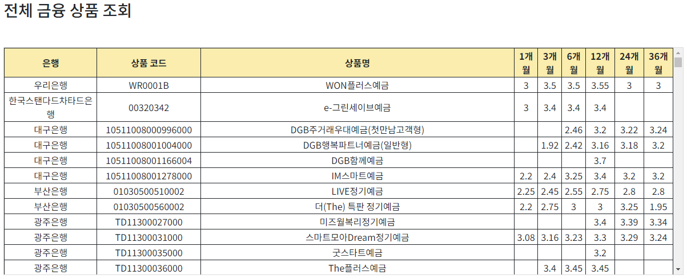
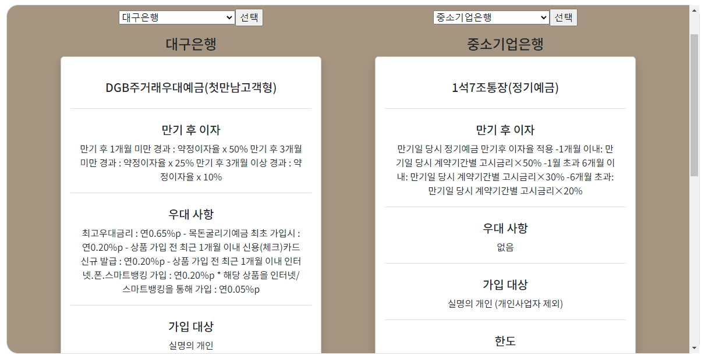
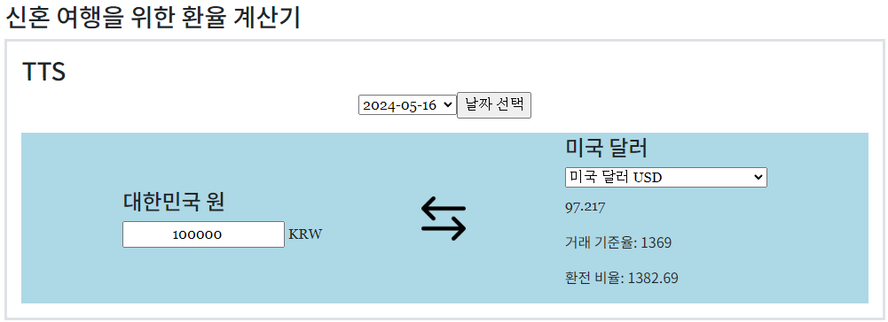
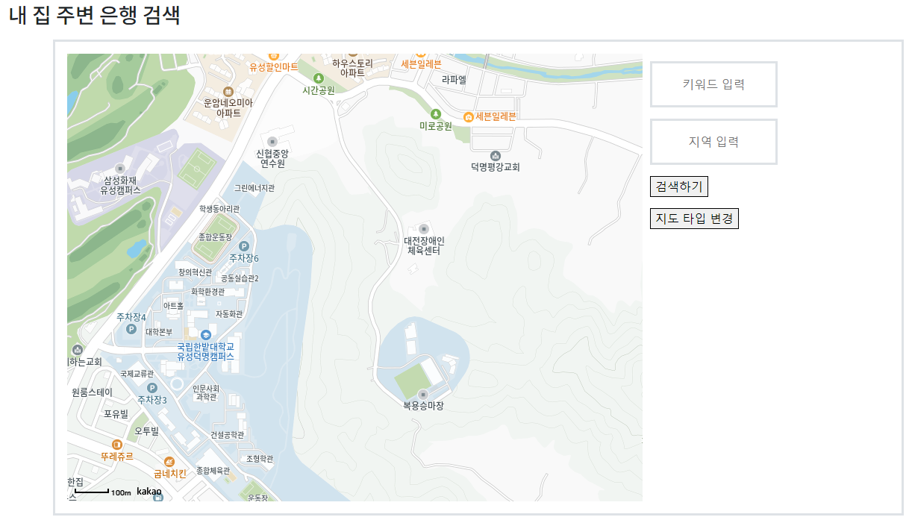
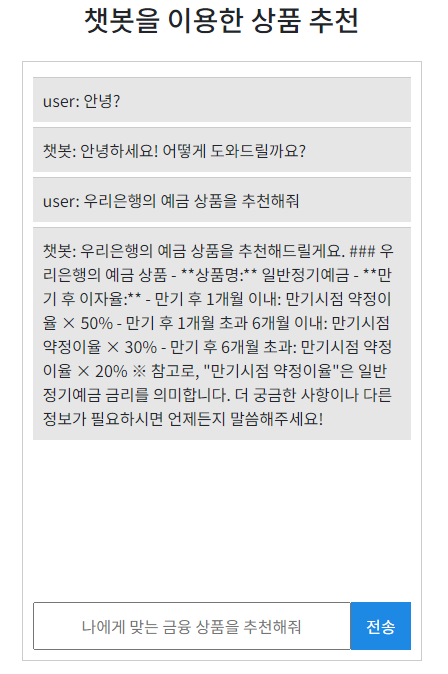

# SSAFY 1학기 최종 프로젝트 YG financial

## INDEX
1. 팀원 정보 및 업무 분담
2. 기획 배경
3. 서비스 소개
4. 금융 상품 추천 알고리즘
5. 기술 스택
6. 기타

## 팀원 정보 및 업무 분담
+ 정규영
    - 프론트엔드 담당 및 팀장

+ 임용구
    - 백엔드, 데이터 담당 및 팀원

## 기획 배경
+ 사회 초년생들과 청년들의 경우 금융에 대해 잘 모르는 경우가 많음
+ 은행과 금융 상품들의 가짓수나 옵션들이 너무많고, 무엇을 선택할 지 망설여진다.
+ 이것들을 한 곳에서 확인할 필요성을 느낌
+ 이에 청년들과 사회 초년생들의 금융 접근성을 좀 더 향상시키고자 기획
+ 금융 상품 이외에도 현재 위치 주변의 지도 검색이나 환율 계산등을 제공하여 접근성 향상

## 서비스 소개
### 커뮤니티 서비스
- 여러 유저들이 금융과 관련된 게시글을 올려 정보를 공유할 수 있는 서비스
- 댓글 기능으로 해당 정보에 관한 질문과 대답 가능

### 전체 금융 상품 조회
- 모든 금융 상품을 한 곳에서 조회 가능
- 금융 상품들의 상품명과 상품을 제공하는 은행 조회 가능
- 각 저축 기간마다 상품에서 제공하는 기준 이자율 확인 가능

### 예적금 상품 비교
- 예금 상품, 혹은 적금 상품간의 비교
- 은행과 각 상품, 옵션을 선택할 시 한 곳에서 두 상품을 비교 가능

### 신혼여행을 위한 환율 계산기
- 신혼 여행을 외국으로 간다면 환전은 필수적이다.
- 이에 각 나라별 환율 계산 기능을 제공

### 주변 은행 검색
- 카카오 맵을 활용하여 현재 위치 주변의 은행 검색 기능 제공

### 챗봇 금융 상품 추천
- 금융 상품이 너무 많기에 쉽사리 선택하기 어려움
- 그렇기에 챗봇을 활용하여 금융 상품을 추천

## 금융 상품 추천 알고리즘
- Open AI의 gpt-4o 모델을 활용하여 챗봇을 구현
- 서버 시작시 데이터베이스의 은행, 예금, 적금 상품들의 정보를 배열 형태로 저장
- 챗봇에게 특정 단어를 포함하는 입력이 들어올 경우 system에 추가적인 명령을 입력
    - ex) '예금' 상품을 '추천'해줘 -> system에 '예금 데이터를 기반으로 대답해줘'라고 입력
- 입력을 위한 예금, 적금 데이터의 경우 그 크기가 너무 크기에 필드를 제한
    - 은행명과 만기 후 이자 등의 데이터를 입력

## 기타
### 느낀 점
- 기획했던 기능들을 전부 구현해내지 못해서 아쉽다.
- 초반 기획과 설계를 꼼꼼하게 하지 않아서 코드 구현 단계에서 복잡하게 엉키게 되었다.
- 모듈들과 컴포넌트들이 서로 과하게 의존적인 것 같다.
- 이후 진행할 프로젝트에서는 코드 구현 단계보다는 기획과 설계 단계에 중점을 두어야 한다.